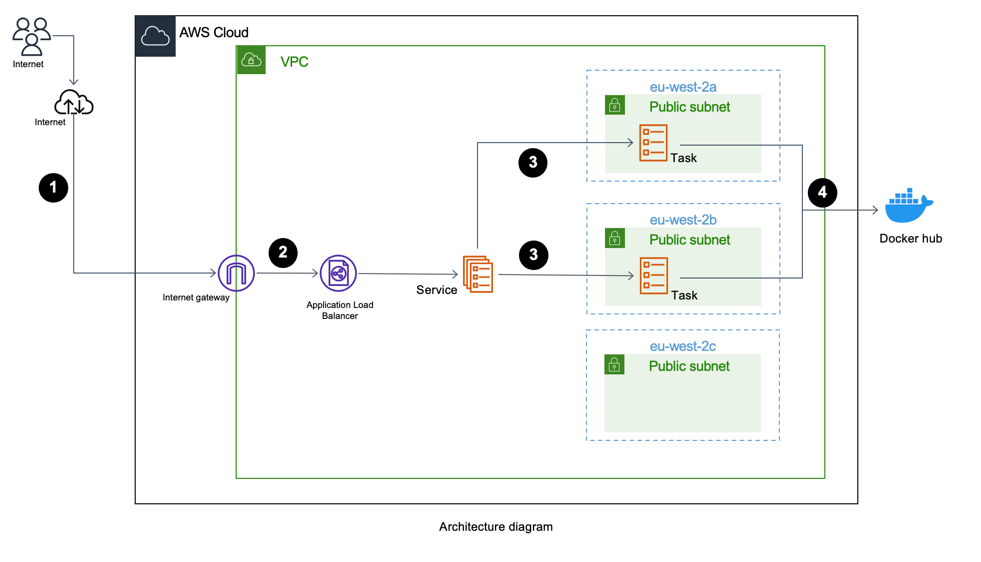
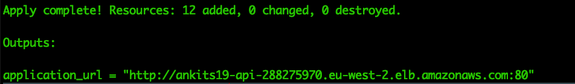
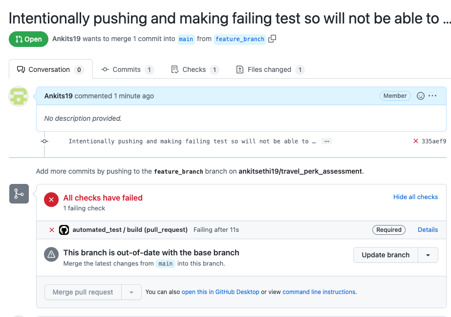
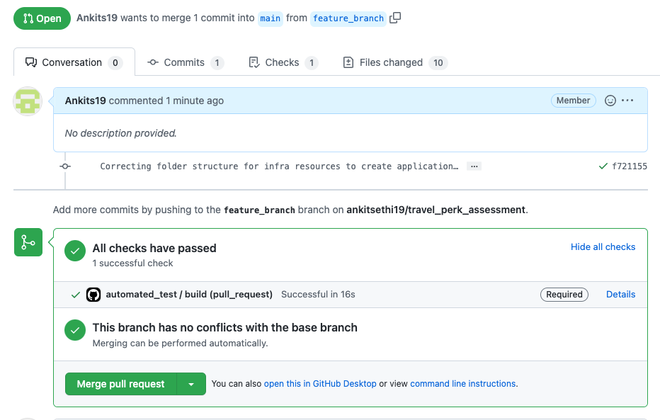

# Travel Perk Assessment
This document will help you to understand code and help to deploy application in any AWS account.

## Deployment

This code uses AWS as public cloud provider and terraform as Iac Tool to deploy application and AWS services.
Divided to 3 simple steps to understand easier:

- Dockerize Application
- Infra resources deployment
- CI-CD Deployment

### Containerization fo Application

Docker is used as container tool to make docker image available to be deployed in ECS for python application 
Please find [Dockerfile](./DockerFiles/Dockerfile) used for application.

Run below commands to create docker image locally:

```commandline
cd DockerFiles
docker buildx build --platform linux/amd64 --load -t hello_app .
```

To make it simple, image is created and pushed to docker hub, if you wish to pull docker image can pull from  [docker hub link](https://hub.docker.com/repository/docker/ankits19/travel_perk_app)

Please run below command to pull docker image.

```commandline
docker pull ankits19/travel_perk_app
```
### AWS resources deployment

As AWS is used public cloud platform, so core services to implement this application running used are ECS, IAM, Load Balancing, Networking.

Below is the architecture for the application deployed in AWS.



**Steps to deploy**

Navigate to `infra` folder and run `terraform init && terraform plan && terraform apply --auto-approve`.

Above command will create resources need to make the application running in AWS ECS services and tasks and frontened by Application load balancer.

Post deployment you will get load balancer DNS name which can be used to access application.



### CI-CD deployment

This section helps to understand basic components and features of CI/CD platform.

When ever there will be pull request raised for `main` branch, `automated_test` workflow will be triggered which will test code with our application.
1. If tests **failed**, github won't allow user to merge the request to main branch due to protection rule added to main branch.
Please refer below example:



2. If tests **passed**, github will allow user to merge the request to main branch as all the status checks passed.
Please refer below example:




## Destory Application

Run below command to destroy resources created in AWS account:

```commandline
cd infra
terraform destroy --auto-approve
```